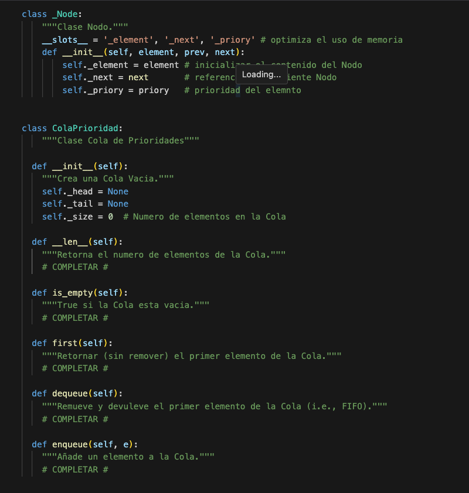

# 2do PARCIAL - Algoritmos y Estructuras de datos - MARTES 25 - JUNIO - 2024 

## Modalidad:

- El parcial estará habilitado para su resolución desde: Martes 25/06 @ 18:15hs, hasta: Miercoles 26/06 @ 01:45hs. (pueden elegir cuando comenzar el intento)

- Tienen 1 (uno) sólo  intento para resolver la actividad; el tiempo máximo es 4 (cuatro) horas.

- **El tiempo será contabilizado desde el momento que aceptan realizar la actividad en Github Classroom, y cualquier "commit" realizado luego de 4 horas no será aceptado como parte del intento de resolución!!**

- Los test / resultados sólo será visibles luego de que la fecha/horario límite han transcurrido.   

# Ejercicios:

## (2pt.) Ejercicio 1:

Definir una clase <code>Producto</code>, el cual contiene los siguientes datos:

<code>descripcion : 'string' </code>

<code>ID : 'integer' </code>

<code>FechaExp : date, ## importar datetime </code>

<code>INFO : 'de cualquier tipo' </code>

La clase debe contener los siguinetes métodos:
 
- Cambiar uno o varios datos del Producto.
- <code>calcular_expirados()</code>Calcular en cuantos dias/horas expira un producto. Si el método detecta que el producto ha expirado, debera lanzar una excepción.

Sobrecarga de métodos: 

- <code>\_\_str\_\_</code>
- <code>\_\_eq\_\_</code>

<u><b>Importante:</b></u> 
- Pueden agregar más atributos y métodos, si lo consideran necesario.  

## (2pt.) Ejercicio 2:

Crear una clase <code>Mercado</code>, el cual estara representado mediante una o varias *Listas Enlazadas* cuyos nodos contengan como dato objetos del tipo <code>Producto</code>. Cada lista enlazada corresponde a un pasillo (o sección del mercado).

La clase debe contener métodos para facilitar:
 
- Controlar el stock de productos (añadir y remover, etc). 
- Calcular en cuantos productos expiran en las proximas 24hs y removerlos.

<u><b>Importante:</b></u> 
- Pueden agregar más atributos y métodos, si lo consideran necesario.

## (1pt.) Ejercicio 3: 

Añadir un método a la clase <code>Mercado</code> que permita buscar un producto y removerlo (venderlo). Recordar que deben actualizar el stock. Si un producto se termina, el método debe lanzar una excepcion.

<u><b>Importante:</b></u> 
- Utilizar Iteradores de ser posible.
- Pueden agregar más atributos y funciones/métodos, si lo consideran necesario. 

## (2pt.) Ejercicio 4: 

Añadir a la clase <code>Mercado</code> un atributo <code>clientes</code> implementando una clase <code>ColaPrioridad</code> utilizando el siguiente modelo de definición (completar los métodos definidos en el modelo). Una Cola de Prioridades es similar a una cola pero sus elementos tienen una prioridad asignada. Los elementos de mayor prioridad serán desencolados primero. Referencia: https://es.wikipedia.org/wiki/Cola_de_prioridades

Importante:
- Pueden agregar más atributos y métodos, si lo consideran necesario.

## (1pt.) Ejercicio 5:

Implementar un **Iterador** para la clase <code>ColaPrioridad</code>.

## (1pt.) Ejercicio 6:
Escribir una función, llamada <code>head</code> que reciba como parámetros un archivo y un número <code>N</code> e imprima las primeras <code>N</code> líneas del archivo.

## (1pt.) Ejercicio 7:
Escribir una función, llamada <code>grep</code> que reciba una expresión y un archivo, e imprima las líneas del archivo que contienen la expresión recibida.